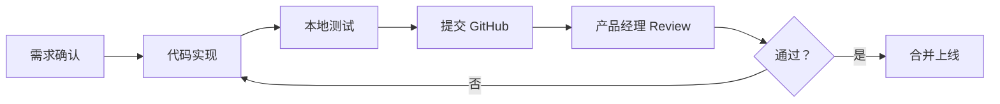

# 开发规范

## 代码结构

```
stock-selector/
├── data/              # 数据存储
│   ├── raw/           # 原始数据
│   └── processed/     # 处理后数据
├── strategies/        # 选股策略
│   ├── __init__.py
│   ├── base.py        # 策略基类
│   └── *.py           # 具体策略实现
├── backtest/          # 回测系统
│   ├── __init__.py
│   ├── engine.py      # 回测引擎
│   ├── report.py      # 报告生成
│   └── metrics.py     # 性能指标
├── utils/             # 工具函数
│   ├── __init__.py
│   ├── data_loader.py # 数据加载
│   └── indicators.py  # 技术指标
├── config/            # 配置文件
│   ├── settings.py    # 系统配置
│   └── *.yaml         # 策略配置
├── docs/              # 文档
├── tests/             # 单元测试
├── requirements.txt   # 依赖
├── CHANGELOG.md       # 变更日志
└── README.md          # 项目说明
```

## 策略开发流程

1. **需求分析** - 与产品经理确认选股逻辑
2. **策略实现** - 继承 `BaseStrategy` 实现新策略
3. **单元测试** - 编写测试用例
4. **回测验证** - 运行回测生成报告
5. **代码 Review** - 提交产品经理审核
6. **迭代优化** - 根据反馈修改

## Git 提交规范

```bash
# 新功能
git commit -m "feat: 添加 MACD 选股策略"

# 修复 bug
git commit -m "fix: 修复数据加载异常"

# 文档更新
git commit -m "docs: 更新策略使用说明"

# 代码重构
git commit -m "refactor: 优化回测引擎性能"
```

## 回测报告格式

回测完成后输出：
- 总收益率 (%)
- 年化收益率 (%)
- 夏普比率
- 最大回撤 (%)
- 胜率 (%)
- 交易次数
- 收益曲线图
- 持仓分布图

## 协作流程


